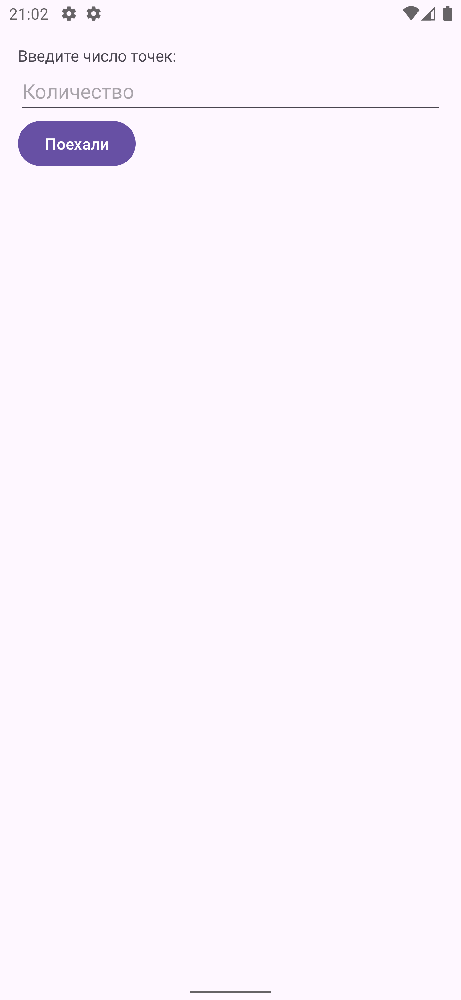
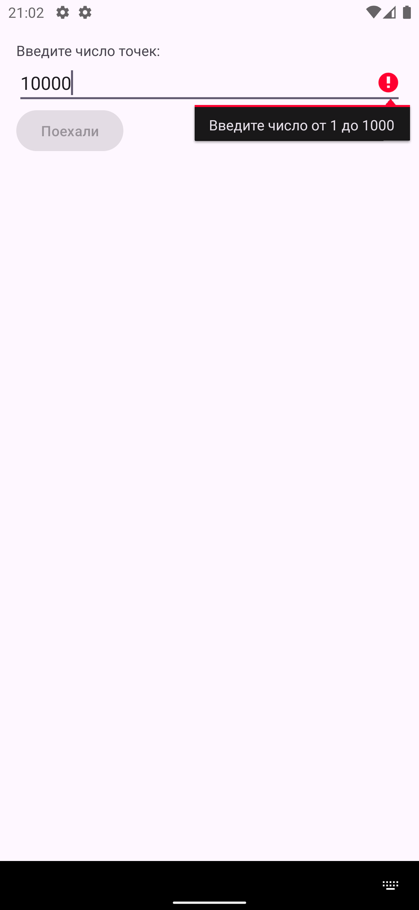
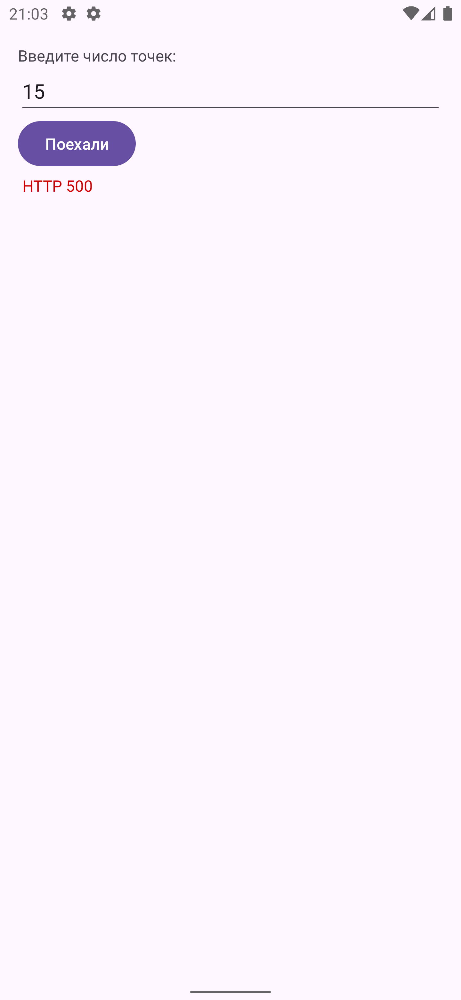
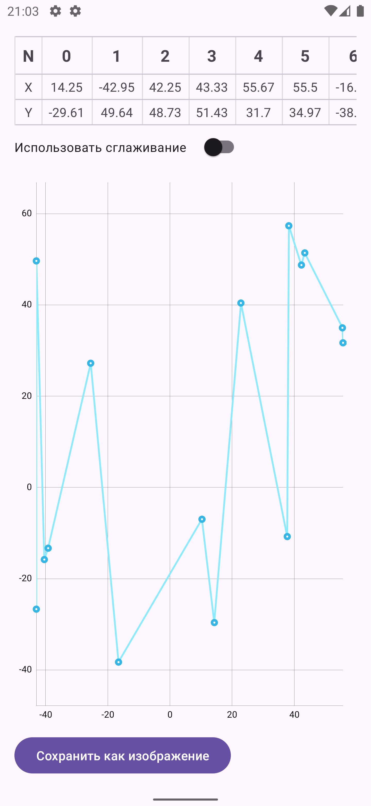
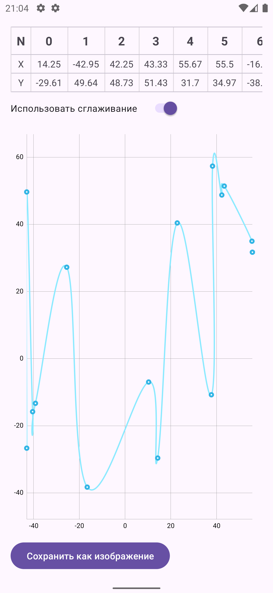

# TapYouTestTask

**Тестовое задание для проекта TapYou**

---

## Ссылка на задание
[Перейти к описанию тестового задания](https://hr-challenge.dev.tapyou.com/api/test/text/android)

---

## Описание
Данное приложение реализует требования тестового задания TapYou. Поскольку в ТЗ отсутствуют макеты и подробное описание экранов, реализованное поведение может сильно отличаться от задуманного в оригинале. В коде оставлены комментарии в ключевых местах — там, где для полноценного продакшн-решения стоило бы углубиться в детали, но для демонстрации основных идей тестового приложения это было признано избыточным.

---

## Выбранный стек и обоснование

- **Kotlin**  
  В 2025 году использование Java для новых Android-проектов выглядит устаревшим. Kotlin позволяет писать более лаконичный и безопасный код.

- **Views (Android View System)**  
  В ТЗ указано предпочтение классических View, поэтому UI реализован без использования Jetpack Compose.

- **ViewModel (Android Architecture Components)**  
  В компании принят подход MVP с библиотекой Moxy, и у меня есть опыт работы с ней. Однако Moxy не выглядит перспективным выбором для нового проекта, поэтому для упрощения приоритезации архитектуры используется стандартный `ViewModel`.

- **Dagger 2**  
  Библиотека по-прежнему актуальна и указана в стеке проекта, проблем с её использованием не возникло.

- **Cicerone**  
  Простая и удобная библиотека для навигации, обеспечивающая легкую настройку навигационных переходов.

- **MPAndroidChart**  
  Надежная и широко используемая библиотека для построения графиков. Решает все поставленные задачи, связанные с отображением точек и линий.  
  (Вместо неё можно было бы написать свою кастомную View, но это заняло бы слишком много времени в контексте тестового задания.)

- **minSdkVersion 24**  
  В ТЗ не было указано конкретного минимального уровня API, поэтому выбран 24 (Android 7.0), что покрывает большую часть активных устройств.

---

## Особенности реализации

1. **Гибкость макетов**  
   Поскольку не было предоставлено дизайна, внешние виды экранов могут отличаться от ожиданий. Я постарался сделать интерфейс максимально интуитивным и простым.

2. **Комментарии в коде**  
   В местах, где требуется более глубокое решение (например, детальная обработка ошибок, тестовое покрытие), оставлены комментарии и пояснения. Это позволяет понять, как я бы действовал в реальном проекте (например, единый обработчик ошибок для всех запросов, проверка кодов ответов и т. д.).

3. **Обработка ошибок**  
   В приложении присутствует базовая валидация и обработка ошибок. В реальном продакшн-проекте я бы добавил централизованный обработчик, который анализирует коды ошибок от бэкенда и отдельно обрабатывает клиентские ошибки. Однако в контексте небольшого тестового задания такая глубина реализации воспринимается как оверхед.

4. **Графики (MPAndroidChart)**  
   - Построение линейного графика с соединенными точками  
   - Поддержка зума и масштабирования жестами  
   - Возможность сохранения картинки графика в файл/галерею  
   - Автоматическая адаптация под портретную и ландшафтную ориентации экрана

---

## Скриншоты и видеозапись работы приложения

> **Папка с медиафайлами:**  
> `Media/Demo1.png`  
> `Media/Demo2.png`  
> `Media/Demo3.png`  
> `Media/Demo4.png`  
> `Media/Demo5.png`  
> `Media/ScreenRecording.mov`

  
  
  
  
  

> _Видео работы приложения:_  
> [Смотреть ScreenRecording.mov](Media/ScreenRecording.mov)

---

## Благодарю за внимание!
Если возникнут вопросы по архитектурным решениям или реализации деталей — обращайтесь. Любые замечания и предложения по улучшению можно обсудить.
